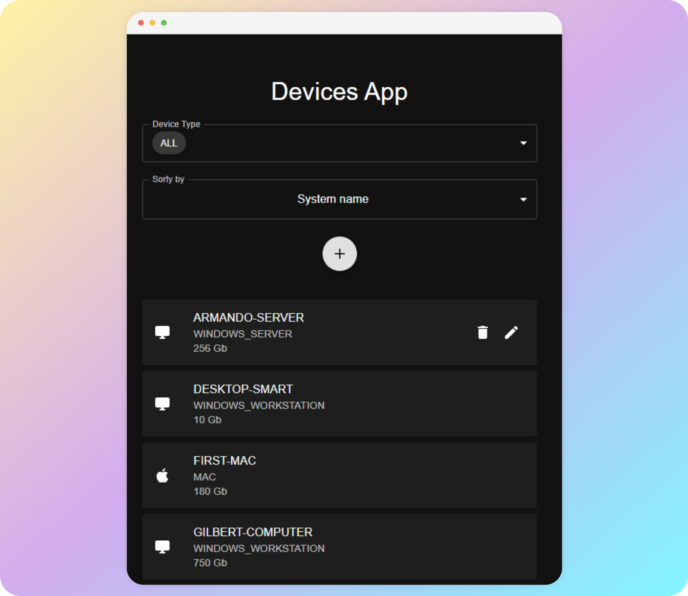
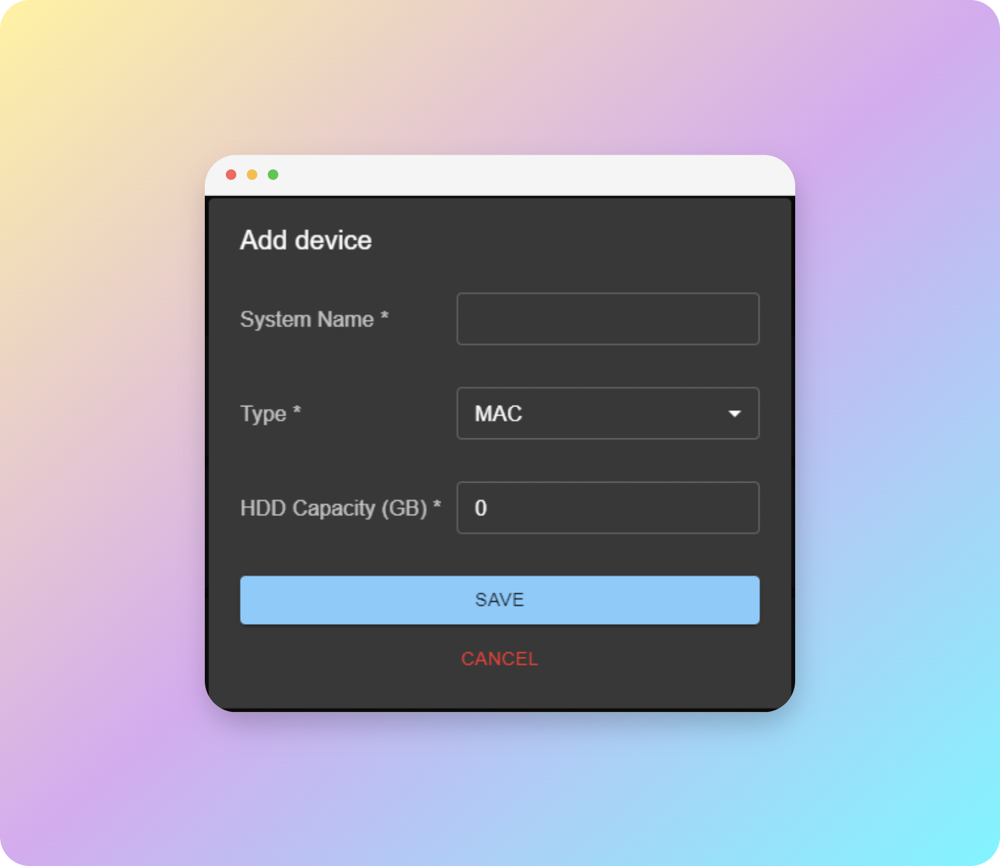
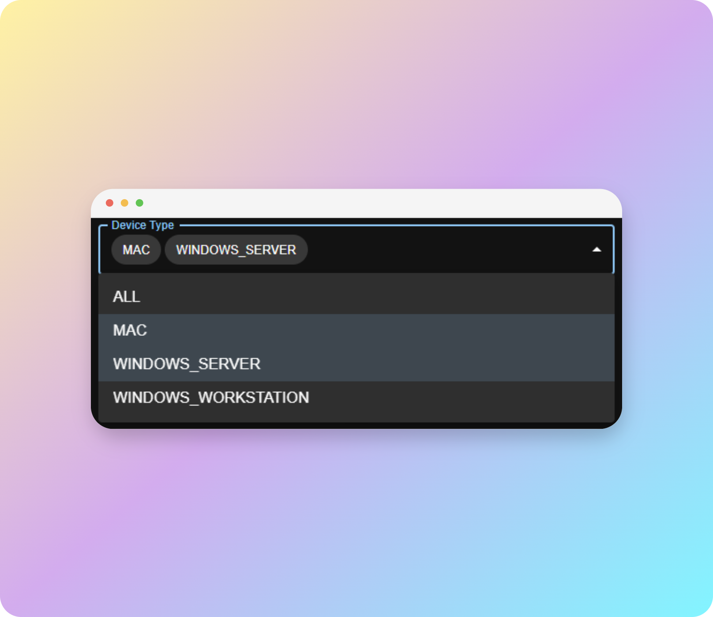
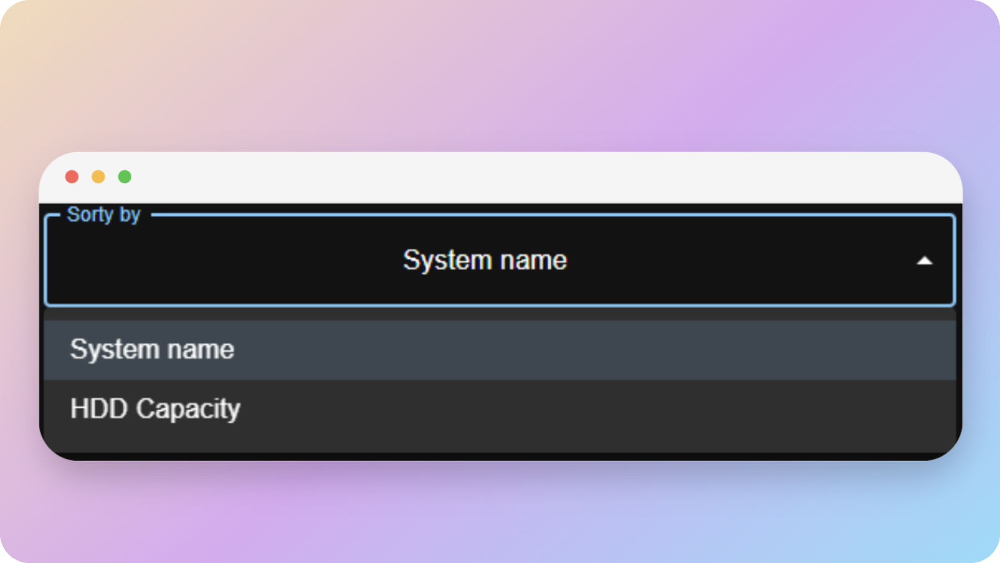
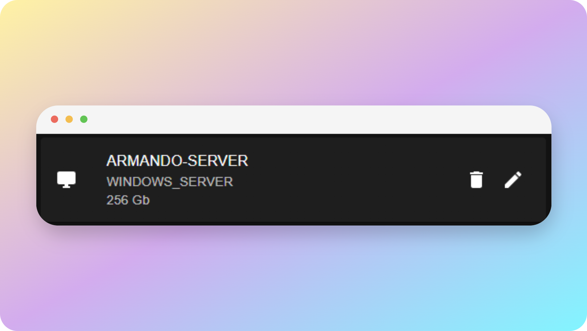

<h1 align="center">
	Devices App
</h1>
<p align="center">
	A simple CRUD application built with 
	<a href="https://reactjs.org">React</a>.
</p>


##  Technologies Used

- [React](http://reactjs.org)

- [Material UI](https://mui.com/)

-  [Axios](https://axios-http.com/) 

- [Notistack](https://notistack.com/)

##  Development

Install dependencies:

```bash
$ npm i || npm install
```

Now, you can start a local web server by running:

```bash
$ npm start
```

and then you can open http://localhost:3000 to view it in the browser.

## Basic Features

- [x] Create
- [x] Read
- [x] Update
- [x] Delete

## Usage

1. To add a device you have to click in 'Add' and fill form


2. You can filter by multiple type devices

3. You can sorty by name or HDD capacity

4. Put mouse over in the device card to update or delete


